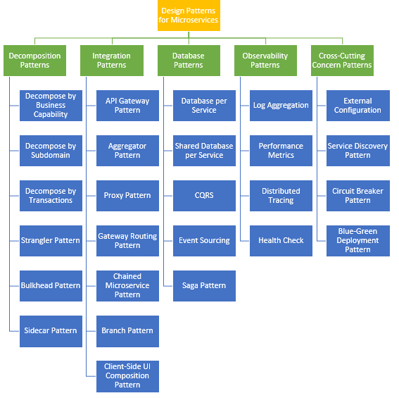

# Event Driven Systems: Microservices

## Table of Contents

1. [Problems with Traditional Request-Response Model](#1-problems-with-traditional-request-response-model)
2. [Tight Coupling](#2-tight-coupling)
3. [How Event-Driven Architecture (EDA) Solves It](#3-how-event-driven-architecture-eda-solves-it)
4. [Key Components of EDA](#4-key-components-of-eda)
5. [How Large Scale Systems handle Events](#how-large-scale-systems-handle-events)
6. [Crucial Components during Event Driven System](#crucial-components-during-event-driven-system)
7. [Patterns in Event Driven System](#patterns-in-event-driven-system)
   - [Decomposition Patterns](#decomposition-patterns)
   - [Integration Patterns](#integration-patterns)
   - [Database Patterns](#database-patterns)
   - [Observability Patterns](#observability-patterns)
   - [Cross-Cutting Concern Patterns](#cross-cutting-concern-patterns)
   - [Event-Driven Specific Patterns](#event-driven-specific-patterns)

---

## 1. Problems with Traditional Request-Response Model

In a synchronous model (e.g., REST over HTTP), services communicate directly:

*   **Blocking Interactions:** The caller waits for the receiver. Latency is additive across the call chain.
*   **Cascading Failures:** If a downstream service fails, the upstream service waits until it times out, potentially exhausting resources (threads) and causing a system-wide outage.
*   **Rigidity:** Adding new functionality often requires modifying the orchestration logic in the caller.

## 2. Tight Coupling

Direct communication creates dependencies:

*   **Temporal Coupling:** Sender and Receiver must be available simultaneously.
*   **Location Coupling:** The sender requires knowledge of the receiver's address.
*   **Data Coupling:** The sender is often bound to the specific API contract of the receiver.

## 3. How Event-Driven Architecture (EDA) Solves It

EDA uses an intermediary (Event Broker) to facilitate asynchronous communication:

*   **Decoupling:**
    *   *Temporal:* Producers send events to a broker. Consumers process them when ready.
    *   *Logical:* Producers are unaware of consumers. New consumers can be added without changing the producer.
*   **Resilience:** Failures in consumers do not impact producers. Events persist in the broker until processed.
*   **Scalability:** Components scale independently based on event volume (queue depth) rather than synchronous traffic spikes.
*   **Responsiveness:** User requests are acknowledged immediately (e.g., "Request Accepted"), while processing happens in the background.

## 4. Key Components of EDA

An Event-Driven Architecture consists of four main building blocks:

1.  **Event:** A record of a significant change in state (e.g., "Order Placed"). It is immutable and timestamped.
2.  **Producer (Publisher):** The upstream service that detects the change and emits the event. It has no knowledge of downstream consumers.
3.  **Event Broker (Ingestor/Router):** Middleware (like Kafka, RabbitMQ) that receives, stores, and routes events. It decouples the producer from the consumer.
4.  **Consumer (Subscriber):** The downstream service that listens to the broker, processes the event, and executes business logic.

## How Large Scale Systems handle Events

### Uber

### Netflix

---

## Crucial Components during Event Driven System

# Patterns in Event Driven System

## Pattern Categories Overview

| Decomposition Patterns | Integration Patterns | Database Patterns | Observability Patterns | Cross-Cutting Concerns | Event-Driven Specific |
|---|---|---|---|---|---|
| [Decompose by Business Capability](#1-decompose-by-business-capability) | [**API Gateway Pattern**](#7-api-gateway-pattern) | [**Database per Service**](#14-database-per-service) | [Log Aggregation](#19-log-aggregation) | [External Configuration](#23-external-configuration) | [Event Notification](#27-event-notification-pattern) |
| [Decompose by Subdomain](#2-decompose-by-subdomain) | [**Aggregator Pattern**](#8-aggregator-pattern) | [Shared Database](#15-shared-database-per-service) | [Performance Metrics](#20-performance-metrics) | [Service Discovery](#24-service-discovery-pattern) | [Transactional Outbox](#28-transactional-outbox-pattern) |
| [Decompose by Transactions](#3-decompose-by-transactions) | [Proxy Pattern](#9-proxy-pattern) | [**CQRS**](#16-cqrs-command-query-responsibility-segregation) | [Distributed Tracing](#21-distributed-tracing) | [**Circuit Breaker**](#25-circuit-breaker-pattern) | [Inbox Pattern](#29-inbox-pattern-inbound-events) |
| [**Strangler Fig**](#4-strangler-fig-pattern) | [Gateway Routing](#10-gateway-routing-pattern) | [**Event Sourcing**](#17-event-sourcing) | [**Health Check**](#22-health-check-pattern) | [Blue-Green Deployment](#26-blue-green-deployment-pattern) | [**Dead Letter Queue**](#30-dead-letter-queue-dlq) |
| [**Bulkhead**](#5-bulkhead-pattern) | [Chained Microservice](#11-chained-microservice-pattern) | [**Saga Pattern**](#18-saga-pattern) | | | [Idempotent Consumer](#31-idempotent-consumer) |
| [**Sidecar**](#6-sidecar-pattern) | [Branch Pattern](#12-branch-pattern) | | | | [Compensating Transaction](#32-compensating-transaction-pattern) |
| | [Client-Side UI Composition](#13-client-side-ui-composition-pattern) | | | | [Event Filtering](#33-event-filtering-pattern) |
| | | | | | [Event Aggregation](#34-event-aggregation-pattern) |
| | | | | | [Event Replay](#35-event-replay-pattern) |
| | | | | | [Event Streaming](#36-event-streaming-pattern) |
| | | | | | [Temporal Event](#37-temporal-event-pattern) |
| | | | | | [Event Versioning](#38-event-versioning-pattern) |
| | | | | | [Polyglot Persistence](#39-polyglot-persistence-pattern) |
| | | | | | [Event-Driven Workflow](#40-event-driven-workflow-pattern) |
| | | | | | [Publish-Subscribe](#41-publish-subscribe-pattern) |
| | | | | | [Request-Reply](#42-request-reply-pattern) |
| | | | | | [Correlation ID](#43-correlation-id-pattern) |
| | | | | | [Retry with Backoff](#44-retry-pattern-with-exponential-backoff) |
| | | | | | [Eventual Consistency](#45-eventual-consistency-pattern) |
| | | | | | [Two-Phase Commit](#46-two-phase-commit-2pc-pattern) |

---

---

## Decomposition Patterns

### 1. Decompose by Business Capability
Organize microservices around business capabilities rather than technical layers.
*   **Benefit:** Aligns services with business domains, improving maintainability.
*   **Example:** Order Service, Inventory Service, Payment Service.

### 2. Decompose by Subdomain
Uses Domain-Driven Design (DDD) to identify subdomains and create services around them.
*   **Benefit:** Clear boundaries and reduced coupling between services.
*   **Implementation:** Identify core, supporting, and generic subdomains.

### 3. Decompose by Transactions
Organize services based on transaction boundaries.
*   **Benefit:** Reduces distributed transaction complexity.
*   **Use Case:** Services that handle complete business transactions independently.

### 4. Strangler Fig Pattern
Used for migrating legacy monolithic systems to microservices.
*   **Approach:** Gradually replace specific functionalities of the legacy system with new microservices and event-driven flows, eventually "strangling" the old system until it can be decommissioned.

### 5. Bulkhead Pattern
Isolates resources (threads, connections) to prevent cascading failures.
*   **Benefit:** Failure in one service doesn't exhaust resources needed by others.
*   **Implementation:** Thread pools, connection pools, resource quotas.

### 6. Sidecar Pattern
Deploys a companion container alongside the main service to handle cross-cutting concerns.
*   **Use Case:** Logging, monitoring, security, configuration management.
*   **Benefit:** Decouples infrastructure concerns from business logic.

## Integration Patterns

### 7. API Gateway Pattern
Single entry point for client requests that routes to appropriate microservices.
*   **Responsibilities:** Request routing, protocol translation, authentication, rate limiting.
*   **Event Integration:** Can publish events based on API calls or subscribe to service events.

### 8. Aggregator Pattern
Combines data from multiple services into a single response.
*   **Use Case:** Complex queries requiring data from multiple microservices.
*   **Implementation:** Aggregator service calls multiple services and merges results.

### 9. Proxy Pattern
Provides a placeholder or surrogate for another object to control access.
*   **Use Case:** Lazy loading, access control, logging.
*   **Benefit:** Decouples clients from actual service implementation.

### 10. Gateway Routing Pattern
Routes requests to different services based on URL patterns or request attributes.
*   **Benefit:** Simplifies client-side routing logic.
*   **Implementation:** API Gateway with routing rules.

### 11. Chained Microservice Pattern
Services call each other in a chain to fulfill a request.
*   **Limitation:** Creates temporal coupling and cascading failures.
*   **Alternative:** Use event-driven architecture for better resilience.

### 12. Branch Pattern
Allows parallel invocation of multiple services and combines results.
*   **Benefit:** Reduces latency by parallelizing service calls.
*   **Use Case:** Fetching data from multiple independent services.

### 13. Client-Side UI Composition Pattern
Composes UI from multiple microservices on the client side.
*   **Benefit:** Services remain independent; no server-side composition needed.
*   **Challenge:** Increased client-side complexity.

## Database Patterns

### 14. Database per Service
Each microservice has its own dedicated database.
*   **Benefit:** Services are loosely coupled; can choose optimal database technology.
*   **Challenge:** Distributed transactions and data consistency become complex.

### 15. Shared Database per Service
Multiple services share a single database with separate schemas.
*   **Limitation:** Creates tight coupling between services.
*   **Not Recommended:** Violates microservices principles.

### 16. CQRS (Command Query Responsibility Segregation)
Separates the read and write models of an application.
*   **Command Side:** Handles updates (creates, updates, deletes). Optimized for transactional integrity.
*   **Query Side:** Handles reads. Optimized for high-performance queries (often using denormalized views).

### 17. Event Sourcing
Persists the state of a business entity as a sequence of state-changing events rather than just the current state.
*   **Benefits:** Complete audit trail, ability to replay events to rebuild state or fix bugs, temporal queries.
*   **Snapshotting:** Often used to speed up state reconstruction.
* **Materialized Views:** Precomputed read models optimized for specific query patterns.

### 18. Saga Pattern
Used to manage distributed transactions that span multiple services. Since traditional ACID transactions are not possible, Sagas break the transaction into a sequence of local transactions.
*   **Choreography:** Services react to events from other services (decentralized).
*   **Orchestration:** A central coordinator tells services what to do.

## Observability Patterns

### 19. Log Aggregation
Centralized collection and analysis of logs from all microservices.
*   **Tools:** ELK Stack (Elasticsearch, Logstash, Kibana), Splunk, Datadog.
*   **Benefit:** Enables debugging and monitoring across distributed systems.

### 20. Performance Metrics
Collects and monitors performance metrics from services.
*   **Metrics:** Response time, throughput, error rate, resource utilization.
*   **Tools:** Prometheus, Grafana, New Relic.

### 21. Distributed Tracing
Tracks requests across multiple services to understand system behavior.
*   **Tools:** Jaeger, Zipkin, AWS X-Ray.
*   **Benefit:** Identifies bottlenecks and latency issues.

### 22. Health Check Pattern
Services expose health endpoints to indicate their operational status.
*   **Implementation:** Liveness probes, readiness probes.
*   **Benefit:** Enables automated recovery and load balancing decisions.

## Cross-Cutting Concern Patterns

### 23. External Configuration
Externalizes configuration to environment variables or configuration servers.
*   **Benefit:** Enables deployment across different environments without code changes.
*   **Tools:** Spring Cloud Config, Consul, etcd.

### 24. Service Discovery Pattern
Automatically discovers service locations in a dynamic environment.
*   **Benefit:** Services can be deployed, scaled, or moved without manual configuration.
*   **Tools:** Consul, Eureka, Kubernetes DNS.

### 25. Circuit Breaker Pattern
Prevents cascading failures by stopping requests to failing services.
*   **States:** Closed (normal), Open (failing), Half-Open (testing recovery).
*   **Benefit:** Fails fast and allows time for recovery.

### 26. Blue-Green Deployment Pattern
Maintains two identical production environments to enable zero-downtime deployments.
*   **Process:** Deploy to inactive environment, test, then switch traffic.
*   **Benefit:** Quick rollback if issues are detected.

## Event-Driven Specific Patterns

### 27. Event Notification Pattern
Services publish events when something important happens, and other services subscribe to those events.
*   **Use Case:** Loosely coupled systems where services need to react to state changes in other services.
*   **Example:** Order service publishes "OrderCreated" event; Inventory and Notification services subscribe.

### 28. Transactional Outbox Pattern
Solves the "Dual Write" problem (updating a database and sending a message to a broker atomically).
*   **Mechanism:** The service saves the event to a local database table ("Outbox") in the same transaction as the business data. A background process (CDC or Polling) then publishes these events to the broker.

### 29. Inbox Pattern (Inbound Events)
Complements the Outbox Pattern by ensuring reliable consumption of events.
*   **Mechanism:** Consumer stores incoming events in a local "Inbox" table before processing, ensuring no events are lost even if processing fails.
*   **Idempotency:** Combined with idempotent processing, guarantees exactly-once semantics.

### 30. Dead Letter Queue (DLQ)
A specialized queue for messages that cannot be processed successfully.
*   **Purpose:** Prevents a "poison pill" message (malformed or causing errors) from blocking the processing of valid messages.

### 31. Idempotent Consumer
Ensures that processing the same event multiple times produces the same result.
*   **Why it's needed:** Message brokers usually guarantee "at-least-once" delivery, meaning duplicates are possible.
*   **Implementation:** Tracking processed message IDs or designing operations to be naturally idempotent (e.g., setting a status to "PAID" rather than "add 10 to balance").

### 32. Compensating Transaction Pattern
Part of the Saga pattern; defines how to undo or compensate for failed transactions.
*   **Mechanism:** If a step in a distributed transaction fails, compensating transactions are triggered in reverse order to rollback changes.
*   **Example:** If payment fails in an order, trigger "CancelOrder" and "RefundInventory" events.

### 33. Event Filtering Pattern
Consumers filter events based on specific criteria before processing.
*   **Benefit:** Reduces unnecessary processing and improves performance.
*   **Implementation:** Content-based filtering or topic-based subscriptions.

### 34. Event Aggregation Pattern
Combines multiple related events into a single aggregate event for processing.
*   **Use Case:** Reducing noise and improving efficiency when multiple events need coordinated handling.
*   **Example:** Combining multiple "ItemAdded" events into a single "CartUpdated" event.

### 35. Event Replay Pattern
Ability to replay historical events to rebuild state or fix bugs.
*   **Benefit:** Powerful debugging and recovery mechanism.
*   **Requirement:** Events must be immutable and stored durably.

### 36. Event Streaming Pattern
Continuous flow of events through a distributed system using event streaming platforms (Kafka, Pulsar).
*   **Characteristics:** High throughput, low latency, event ordering guarantees.
*   **Use Case:** Real-time analytics, log aggregation, event replay capabilities.

### 37. Temporal Event Pattern
Events include temporal information (timestamps, sequence numbers) for ordering and causality tracking.
*   **Importance:** Ensures correct ordering of events in distributed systems with clock skew.
*   **Implementation:** Logical clocks (Lamport, Vector clocks) or physical timestamps with NTP synchronization.

### 38. Event Versioning Pattern
Handles schema evolution of events over time.
*   **Challenge:** Old consumers may not understand new event formats.
*   **Solutions:** Semantic versioning, backward compatibility, event transformation layers.

### 39. Polyglot Persistence Pattern
Different services use different databases optimized for their specific needs.
*   **Benefit:** Each service can choose the best storage technology (SQL, NoSQL, Graph, etc.).
*   **Challenge:** Distributed transactions become more complex; Event-Driven Architecture helps manage this.

### 40. Event-Driven Workflow Pattern
Orchestrates complex business processes using events and state machines.
*   **Use Case:** Multi-step workflows that span multiple services.
*   **Example:** Order processing workflow with multiple stages (Pending → Processing → Shipped → Delivered).

### 41. Publish-Subscribe Pattern
Decouples publishers from subscribers through a message broker.
*   **Benefit:** Publishers don't need to know about subscribers.
*   **Scalability:** Easy to add new subscribers without modifying publishers.

### 42. Request-Reply Pattern
Synchronous communication where a service sends a request and waits for a reply.
*   **Use Case:** When immediate response is needed.
*   **Limitation:** Creates temporal coupling; use sparingly in event-driven systems.

### 43. Correlation ID Pattern
Tracks requests across multiple services using unique identifiers.
*   **Benefit:** Enables distributed tracing and debugging.
*   **Implementation:** Pass correlation ID through event headers and logs.

### 44. Retry Pattern with Exponential Backoff
Automatically retries failed operations with increasing delays.
*   **Benefit:** Handles transient failures gracefully.
*   **Implementation:** Exponential backoff, jitter to prevent thundering herd.

### 45. Eventual Consistency Pattern
Accepts temporary inconsistency in distributed systems for better availability and performance.
*   **Trade-off:** Consistency vs. Availability (CAP theorem).
*   **Implementation:** Event-driven updates propagate changes asynchronously across services.

### 46. Two-Phase Commit (2PC) Pattern
Distributed transaction protocol ensuring atomicity across multiple services.
*   **Limitation:** Blocking and not suitable for long-running transactions.
*   **Alternative:** Sagas are preferred in event-driven systems.

---

<button onclick="window.scrollTo({top: 0, behavior: 'instant'})" style="position: fixed; bottom: 30px; right: 30px; z-index: 99; padding: 12px 16px; background-color: #007bff; color: white; border: none; border-radius: 50%; cursor: pointer; font-size: 18px; width: 50px; height: 50px; text-align: center; line-height: 24px; box-shadow: 0 4px 8px rgba(0, 0, 0, 0.2); font-weight: bold; transition: background-color 0.3s;" onmouseover="this.style.backgroundColor='#0056b3'" onmouseout="this.style.backgroundColor='#007bff'" onmousedown="this.style.backgroundColor='#003d82'" onmouseup="this.style.backgroundColor='#0056b3'" title="Go to top">↑</button>
