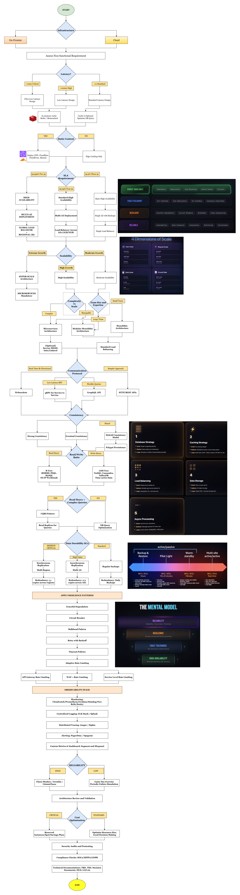

# System Architecture Decision Matrix

## Quick Reference Guide for System Architects



---

## Table of Contents

- [1. Infrastructure Type Decision](#1-infrastructure-type-decision)
  - [On-Premise](#on-premise)
  - [Cloud](#cloud)
- [2. Latency Requirements](#2-latency-requirements)
  - [< 10ms (Ultra Low Latency)](#-10ms-ultra-low-latency)
  - [< 100ms (Low Latency)](#-100ms-low-latency)
  - [< 1s (Standard Latency)](#-1s-standard-latency)
- [3. Availability (SLA) Requirements](#3-availability-sla-requirements)
  - [99.999% (Five 9s) - 5.26 minutes downtime/year](#99999-five-9s---526-minutes-downtimeyear)
  - [99.99% (Four 9s) - 52.56 minutes downtime/year](#9999-four-9s---5256-minutes-downtimeyear)
  - [99.9% (Three 9s) - 8.76 hours downtime/year](#999-three-9s---876-hours-downtimeyear)
- [4. Scalability Requirements](#4-scalability-requirements)
  - [Hyper-Scale (1000x+ growth potential)](#hyper-scale-1000x-growth-potential)
  - [High Scalability (10x-100x growth)](#high-scalability-10x-100x-growth)
  - [Moderate Scalability (2x-10x growth)](#moderate-scalability-2x-10x-growth)
- [5. Consistency Requirements](#5-consistency-requirements)
  - [Strong Consistency](#strong-consistency)
  - [Eventual Consistency](#eventual-consistency)
  - [Hybrid Consistency](#hybrid-consistency)
- [6. Database Selection Matrix](#6-database-selection-matrix)
- [7. Caching Strategy](#7-caching-strategy)
  - [L1 Cache (Application-Level)](#l1-cache-application-level)
  - [L2 Cache (Distributed)](#l2-cache-distributed)
  - [L3 Cache (CDN)](#l3-cache-cdn)
  - [Cache Invalidation Strategies](#cache-invalidation-strategies)
- [8. Monolith vs Microservices Decision Tree](#8-monolith-vs-microservices-decision-tree)
  - [Choose Monolith When:](#choose-monolith-when)
  - [Choose Modular Monolith When:](#choose-modular-monolith-when)
  - [Choose Microservices When:](#choose-microservices-when)
- [9. Communication Protocol Selection](#9-communication-protocol-selection)
- [10. Resilience Patterns](#10-resilience-patterns)
  - [Circuit Breaker](#circuit-breaker)
  - [Bulkhead Pattern](#bulkhead-pattern)
  - [Retry with Exponential Backoff](#retry-with-exponential-backoff)
  - [Timeout Policies](#timeout-policies)
  - [Graceful Degradation](#graceful-degradation)
- [11. Load Balancing Strategies](#11-load-balancing-strategies)
  - [Layer 4 (Transport Layer)](#layer-4-transport-layer)
  - [Layer 7 (Application Layer)](#layer-7-application-layer)
  - [Algorithms](#algorithms)
- [12. Rate Limiting Strategy](#12-rate-limiting-strategy)
  - [API Gateway Level](#api-gateway-level)
  - [Algorithm Choices](#algorithm-choices)
  - [Implementation](#implementation)
- [13. Observability Stack](#13-observability-stack)
  - [Three Pillars](#three-pillars)
  - [Alerting](#alerting)
- [14. Data Replication and Redundancy](#14-data-replication-and-redundancy)
  - [Synchronous Replication](#synchronous-replication)
  - [Asynchronous Replication](#asynchronous-replication)
  - [Multi-Master Replication](#multi-master-replication)
  - [Backup Strategy](#backup-strategy)
- [15. Chaos Engineering](#15-chaos-engineering)
  - [Maturity Levels](#maturity-levels)
  - [Tools](#tools)
  - [Testing Schedule](#testing-schedule)
- [16. Security Considerations](#16-security-considerations)
  - [Defense in Depth](#defense-in-depth)
  - [Encryption](#encryption)
  - [Secrets Management](#secrets-management)
- [17. Cost Optimization](#17-cost-optimization)
  - [Cloud Cost Management](#cloud-cost-management)
  - [Optimization Checklist](#optimization-checklist)
- [18. Final Architecture Validation Checklist](#18-final-architecture-validation-checklist)
  - [Functional Requirements](#functional-requirements)
  - [Non-Functional Requirements](#non-functional-requirements)
  - [Operational Readiness](#operational-readiness)
  - [Documentation](#documentation)
  - [Compliance](#compliance)
- [Decision Framework Summary](#decision-framework-summary)

---

## 1. Infrastructure Type Decision

### On-Premise
**Choose When:**
- Strict data sovereignty requirements
- Regulatory compliance mandates (HIPAA, PCI-DSS with specific controls)
- Existing infrastructure investment
- Predictable, stable workloads
- Lower long-term operational costs for stable loads

**Considerations:**
- Higher upfront capital expenditure
- Longer deployment times
- Manual scaling processes
- Full operational responsibility

### Cloud
**Choose When:**
- Variable/unpredictable workloads
- Global user base
- Fast time-to-market requirements
- Limited operational expertise
- Need for managed services

**Considerations:**
- Pay-as-you-go pricing
- Rapid scaling capabilities
- Managed services availability
- Potential for cloud lock-in

---

## 2. Latency Requirements

### < 10ms (Ultra Low Latency)
**Architecture Decisions:**
- **Caching:** Redis/Memcached with in-memory processing
- **Database:** In-memory databases (Redis, Aerospike)
- **CDN:** Edge computing with CDN
- **Protocol:** gRPC or custom binary protocols
- **Deployment:** Regional edge locations
- **Load Balancing:** Layer 4 (TCP) for minimal overhead

**Use Cases:** Financial trading, gaming, real-time bidding, IoT control systems

### < 100ms (Low Latency)
**Architecture Decisions:**
- **Caching:** Multi-tier caching (L1: Application, L2: Redis)
- **Database:** SSD-backed databases with read replicas
- **CDN:** CDN for static assets
- **Protocol:** HTTP/2, gRPC
- **Deployment:** Multi-AZ in primary regions
- **Load Balancing:** Layer 7 (Application) with health checks

**Use Cases:** E-commerce, social media, streaming platforms

### < 1s (Standard Latency)
**Architecture Decisions:**
- **Caching:** Database-level caching, selective application caching
- **Database:** Standard RDBMS or NoSQL
- **CDN:** Optional for static content
- **Protocol:** HTTP/REST
- **Deployment:** Single or multi-AZ
- **Load Balancing:** Standard application load balancer

**Use Cases:** Internal tools, batch processing, reporting systems

---

## 3. Availability (SLA) Requirements

### 99.999% (Five 9s) - 5.26 minutes downtime/year
**Architecture Pattern:**
- Multi-region active-active deployment
- Global load balancing with automatic failover
- Synchronous data replication across regions
- N+2 redundancy for all components
- Automated recovery and self-healing
- Chaos engineering in production
- 24/7 on-call support

**Components:**
- Multiple database primaries across regions
- Distributed caching layers
- Service mesh with automatic retries
- Global CDN with origin failover

### 99.99% (Four 9s) - 52.56 minutes downtime/year
**Architecture Pattern:**
- Multi-AZ deployment within region
- Active-passive or active-active in region
- Asynchronous replication to backup region
- N+1 redundancy
- Automated health checks and failover
- Scheduled disaster recovery drills

**Components:**
- Primary with synchronous replica in different AZ
- Cross-AZ load balancing
- Automated backup and restore
- Circuit breakers and bulkheads

### 99.9% (Three 9s) - 8.76 hours downtime/year
**Architecture Pattern:**
- Single AZ with backup in different AZ
- Manual or semi-automated failover
- Regular backups (RPO: hours)
- Standard monitoring and alerting

**Components:**
- Primary database with periodic backups
- Single load balancer with health checks
- Standard monitoring setup

---

## 4. Scalability Requirements

### Hyper-Scale (1000x+ growth potential)
**Mandatory Decisions:**
- **Architecture:** Microservices (non-negotiable)
- **Database:** Distributed databases (Cassandra, DynamoDB, CockroachDB)
- **State:** Stateless services, externalized session management
- **Communication:** Event-driven architecture, message queues
- **Caching:** Distributed cache with consistent hashing
- **Data:** Sharding/partitioning strategy from day one
- **Infrastructure:** Auto-scaling groups, container orchestration (Kubernetes)

**Patterns:**
- CQRS for read/write separation
- Event sourcing for audit and replay
- Saga pattern for distributed transactions
- API Gateway for traffic management

### High Scalability (10x-100x growth)
**Recommended Decisions:**
- **Architecture:** Microservices or Modular Monolith
- **Database:** Scalable RDBMS (PostgreSQL with extensions) or NoSQL
- **State:** Mostly stateless with sticky sessions
- **Communication:** REST APIs with async messaging for heavy operations
- **Caching:** Redis cluster or Memcached
- **Infrastructure:** Container-based deployment with auto-scaling

**Patterns:**
- Service-oriented architecture
- Database read replicas
- Horizontal pod autoscaling
- Queue-based load leveling

### Moderate Scalability (2x-10x growth)
**Flexible Decisions:**
- **Architecture:** Monolith or Modular Monolith acceptable
- **Database:** Standard RDBMS with vertical scaling initially
- **State:** Session management flexibility
- **Communication:** REST APIs
- **Caching:** Application-level caching
- **Infrastructure:** VM-based or containers

**Patterns:**
- Vertical then horizontal scaling
- Database connection pooling
- Simple load balancing

---

## 5. Consistency Requirements

### Strong Consistency
**When Required:**
- Financial transactions
- Inventory management
- Booking systems
- Compliance-critical data

**Database Choice:**
- **RDBMS:** PostgreSQL, MySQL, SQL Server
- **NewSQL:** CockroachDB, Google Spanner, YugabyteDB
- **Transactions:** ACID guarantees
- **Replication:** Synchronous with quorum writes
- **Trade-offs:** Higher latency, lower availability during partitions (CAP theorem)

### Eventual Consistency
**When Acceptable:**
- Social media feeds
- Analytics and reporting
- Content delivery
- Recommendation engines

**Database Choice:**
- **NoSQL:** Cassandra, DynamoDB, MongoDB
- **Transactions:** BASE properties
- **Replication:** Asynchronous, multi-master
- **Benefits:** Higher availability, lower latency, better scalability
- **Considerations:** Conflict resolution strategies needed

### Hybrid Consistency
**Use Case:**
- Different consistency for different data types
- Financial data: Strong
- User preferences: Eventual

**Implementation:**
- **Polyglot Persistence:** Multiple database types
- **Pattern:** CQRS with different consistency models
- **Example:** PostgreSQL for transactions + Cassandra for user activity

---

## 6. Database Selection Matrix

| Requirement | Database Choice | When to Use |
|-------------|----------------|-------------|
| **ACID Transactions** | PostgreSQL, MySQL | Banking, e-commerce checkout |
| **High Write Throughput** | Cassandra, ScyllaDB | IoT telemetry, time-series data |
| **Complex Queries** | PostgreSQL, ClickHouse | Analytics, reporting |
| **Document Storage** | MongoDB, CouchDB | Content management, catalogs |
| **Graph Relationships** | Neo4j, Amazon Neptune | Social networks, fraud detection |
| **Time-Series Data** | InfluxDB, TimescaleDB | Monitoring, IoT, metrics |
| **Key-Value Store** | Redis, DynamoDB | Session management, caching |
| **Full-Text Search** | Elasticsearch, Solr | Search functionality |
| **Low Latency Reads** | Redis, Aerospike | Real-time applications |
| **Global Distribution** | DynamoDB, CockroachDB | Multi-region applications |

---

## 7. Caching Strategy

### L1 Cache (Application-Level)
- **Technology:** In-process (Guava Cache, Caffeine)
- **Use Case:** Frequently accessed, rarely changing data
- **TTL:** Seconds to minutes
- **Size:** Limited by application memory

### L2 Cache (Distributed)
- **Technology:** Redis, Memcached
- **Use Case:** Shared cache across instances
- **TTL:** Minutes to hours
- **Patterns:** Cache-aside, Write-through, Write-behind

### L3 Cache (CDN)
- **Technology:** CloudFlare, Akamai, CloudFront
- **Use Case:** Static assets, API responses (with care)
- **TTL:** Hours to days
- **Strategy:** Edge caching with origin shield

### Cache Invalidation Strategies
1. **TTL-based:** Set expiration time
2. **Event-based:** Invalidate on data changes
3. **LRU/LFU:** Least recently/frequently used eviction
4. **Cache warming:** Preload cache with expected data

---

## 8. Monolith vs Microservices Decision Tree

### Choose Monolith When:
- ✅ Small to medium team (< 20 developers)
- ✅ Startup or MVP phase
- ✅ Simple domain with clear boundaries
- ✅ Low deployment frequency acceptable
- ✅ Limited DevOps expertise
- ✅ Single-region deployment
- ✅ Predictable scaling needs

**Benefits:** Simpler debugging, easier testing, faster development initially, lower operational overhead

### Choose Modular Monolith When:
- ✅ Medium team (20-50 developers)
- ✅ Want module independence without microservices complexity
- ✅ Clearer domain boundaries emerging
- ✅ Planning for future microservices migration

**Benefits:** Module-level independence, easier refactoring, single deployment, simpler than microservices

### Choose Microservices When:
- ✅ Large team (50+ developers) or multiple teams
- ✅ Different scaling requirements per component
- ✅ Independent deployment required
- ✅ Polyglot technology needs
- ✅ Clear bounded contexts (DDD)
- ✅ Mature DevOps capabilities
- ✅ Need for fault isolation

**Challenges:** Distributed system complexity, network latency, data consistency, debugging difficulty, operational overhead

---

## 9. Communication Protocol Selection

| Protocol | Use Case | Pros | Cons |
|----------|----------|------|------|
| **REST (HTTP/JSON)** | Public APIs, CRUD operations | Widely supported, easy to debug, cacheable | Verbose, over-fetching/under-fetching |
| **GraphQL** | Client-driven queries, mobile apps | Flexible queries, strong typing, single endpoint | Complex backend, caching challenges, security concerns |
| **gRPC** | Service-to-service, high performance | Fast, efficient, bi-directional streaming, code generation | Not browser-friendly, debugging harder |
| **WebSockets** | Real-time, bi-directional | Low latency, persistent connection | Scaling challenges, stateful connections |
| **Server-Sent Events** | One-way real-time updates | Simple, HTTP-based, auto-reconnect | One-way only, HTTP limitations |
| **Message Queue** | Async processing, decoupling | Reliable, buffering, load leveling | Eventually consistent, complexity |

---

## 10. Resilience Patterns

### Circuit Breaker
**When:** Calling external services or databases
**Implementation:** Hystrix, Resilience4j, Polly
**States:** Closed → Open → Half-Open
**Thresholds:** 
- Failure rate: 50% over 10 requests
- Timeout duration: 5-30 seconds
- Half-open test: 3 successful requests to close

### Bulkhead Pattern
**When:** Isolate critical resources
**Types:**
- Thread pool isolation (separate thread pools per service)
- Semaphore isolation (limit concurrent calls)
**Example:** Payment processing isolated from catalog browsing

### Retry with Exponential Backoff
**When:** Transient failures expected
**Pattern:**
```
Delay = min(max_delay, base_delay * 2^attempt) + jitter
```
**Max Retries:** 3-5
**Jitter:** Prevent thundering herd

### Timeout Policies
**Connection Timeout:** 2-5 seconds
**Read Timeout:** 10-30 seconds (depends on operation)
**Idle Timeout:** 60 seconds

### Graceful Degradation
**Strategy:** Return cached/default data when service fails
**Example:** Show trending products if recommendation engine is down

---

## 11. Load Balancing Strategies

### Layer 4 (Transport Layer)
- **Protocol:** TCP/UDP
- **Speed:** Fastest
- **Use Case:** High-throughput, low-latency
- **Limitation:** No content-aware routing

### Layer 7 (Application Layer)
- **Protocol:** HTTP/HTTPS
- **Features:** URL routing, header-based routing, SSL termination
- **Use Case:** Microservices, A/B testing, canary deployments
- **Trade-off:** Slightly higher latency

### Algorithms
- **Round Robin:** Even distribution (default)
- **Least Connections:** Distribute to least busy server
- **IP Hash:** Sticky sessions based on client IP
- **Weighted Round Robin:** Distribute based on server capacity
- **Least Response Time:** Route to fastest server

---

## 12. Rate Limiting Strategy

### API Gateway Level
- **Per User:** 1000 requests/hour
- **Per IP:** 100 requests/minute
- **Global:** 100,000 requests/second

### Algorithm Choices
- **Token Bucket:** Allows burst, steady refill rate
- **Leaky Bucket:** Smooth constant rate
- **Fixed Window:** Simple, but boundary issues
- **Sliding Window Log:** Accurate, but memory-intensive
- **Sliding Window Counter:** Good balance

### Implementation
- **Application:** Custom middleware
- **Gateway:** Kong, AWS API Gateway, Azure APIM
- **Distributed:** Redis-based rate limiting

---

## 13. Observability Stack

### Three Pillars

#### Metrics (What's happening)
- **Tools:** Prometheus, Grafana, DataDog, New Relic
- **Metrics:**
  - RED: Rate, Errors, Duration
  - USE: Utilization, Saturation, Errors
  - Four Golden Signals: Latency, Traffic, Errors, Saturation
- **Collection:** 15-60 second intervals

#### Logs (Why it happened)
- **Tools:** ELK Stack, Splunk, Loki, CloudWatch
- **Structure:** Structured JSON logging
- **Levels:** ERROR, WARN, INFO, DEBUG
- **Retention:** 30-90 days (hot), 1-2 years (cold)
- **Correlation:** Request ID across all services

#### Traces (Where the time went)
- **Tools:** Jaeger, Zipkin, DataDog APM, AWS X-Ray
- **Sampling:** 1-10% in production
- **Spans:** Annotate with business context
- **Use:** Identify bottlenecks in distributed systems

### Alerting
- **Severity Levels:**
  - P1: Page immediately (service down)
  - P2: Alert during business hours
  - P3: Ticket creation
- **Alert Fatigue Prevention:** Proper thresholds, deduplication, auto-remediation

---

## 14. Data Replication and Redundancy

### Synchronous Replication
- **Use Case:** Strong consistency required
- **RPO:** Near zero (< 1 second)
- **RTO:** Minutes
- **Trade-off:** Performance impact, availability during network partitions
- **Example:** Financial transactions

### Asynchronous Replication
- **Use Case:** High availability, acceptable data loss window
- **RPO:** Seconds to minutes
- **RTO:** Minutes to hours
- **Trade-off:** Potential data loss
- **Example:** User-generated content

### Multi-Master Replication
- **Use Case:** Global write distribution
- **Challenge:** Conflict resolution
- **Strategy:** Last-write-wins, application-level merge
- **Example:** CouchDB, Cassandra

### Backup Strategy
- **Full Backup:** Weekly
- **Incremental:** Daily
- **Point-in-Time Recovery:** Continuous
- **Testing:** Quarterly restore drills
- **3-2-1 Rule:** 3 copies, 2 different media, 1 offsite

---

## 15. Chaos Engineering

### Maturity Levels

**Level 1: Inject Simple Failures**
- Random instance termination
- Network latency injection
- CPU/Memory stress

**Level 2: Dependency Failures**
- Database connection failures
- API endpoint failures
- Third-party service outages

**Level 3: Regional Outages**
- Entire AZ failure
- Region failover testing
- DNS failures

**Level 4: Production Experiments**
- Business hours testing
- Gradual blast radius increase
- Automated rollback on critical metrics

### Tools
- **Chaos Monkey:** Random instance termination
- **Gremlin:** Comprehensive chaos platform
- **LitmusChaos:** Kubernetes-native
- **AWS Fault Injection Simulator:** Managed chaos

### Testing Schedule
- **Dev/Staging:** Daily automated tests
- **Production:** Weekly (off-hours) → Bi-weekly → Weekly (business hours)

---

## 16. Security Considerations

### Defense in Depth
1. **Network Layer:** VPC, security groups, NACLs
2. **Application Layer:** WAF, rate limiting, input validation
3. **Data Layer:** Encryption at rest and in transit
4. **Identity Layer:** IAM, RBAC, MFA
5. **Monitoring Layer:** Security Information and Event Management (SIEM)

### Encryption
- **In Transit:** TLS 1.3, certificate rotation
- **At Rest:** AES-256, key management service
- **Application:** Field-level encryption for sensitive data

### Secrets Management
- **Tools:** HashiCorp Vault, AWS Secrets Manager, Azure Key Vault
- **Rotation:** Automatic 30-90 day rotation
- **Access:** Least privilege, temporary credentials

---

## 17. Cost Optimization

### Cloud Cost Management
- **Right-Sizing:** Regular review of instance types
- **Reserved Instances:** 1-3 year commitment for stable workloads (40-60% savings)
- **Spot Instances:** For fault-tolerant, flexible workloads (70-90% savings)
- **Auto-Scaling:** Scale down during off-peak hours
- **Data Transfer:** Minimize cross-region, use CDN

### Optimization Checklist
- ☐ Delete unused resources (EBS volumes, snapshots, IPs)
- ☐ Use lifecycle policies for S3
- ☐ Enable compression for data transfer
- ☐ Use appropriate storage classes
- ☐ Monitor and optimize database queries
- ☐ Implement caching to reduce compute
- ☐ Tag all resources for cost allocation

---

## 18. Final Architecture Validation Checklist

### Functional Requirements
- ☐ All user stories implemented
- ☐ API contracts defined
- ☐ Data models validated

### Non-Functional Requirements
- ☐ Latency targets met (load testing)
- ☐ Availability SLA achievable (failure mode analysis)
- ☐ Scalability tested (stress testing)
- ☐ Durability guaranteed (backup testing)
- ☐ Consistency model understood
- ☐ Security controls in place

### Operational Readiness
- ☐ Monitoring and alerting configured
- ☐ Runbooks created for common issues
- ☐ On-call rotation established
- ☐ Disaster recovery plan documented and tested
- ☐ Incident response procedures defined

### Documentation
- ☐ Architecture Decision Records (ADRs)
- ☐ System architecture diagram
- ☐ Data flow diagrams
- ☐ API documentation
- ☐ Operational procedures

### Compliance
- ☐ GDPR compliance (if applicable)
- ☐ HIPAA compliance (if applicable)
- ☐ SOC 2 requirements met
- ☐ Data residency requirements satisfied

---

## Decision Framework Summary

```
1. Start with business requirements and constraints
2. Identify non-functional requirements with metrics
3. Make infrastructure choice (Cloud vs On-Premise)
4. Design for required availability and resilience
5. Plan for scalability needs
6. Select appropriate data consistency model
7. Choose databases and storage solutions
8. Design caching and CDN strategy
9. Define service architecture (Monolith vs Microservices)
10. Select communication protocols
11. Implement resilience patterns
12. Setup observability and monitoring
13. Plan data replication and backup
14. Implement security controls
15. Validate with chaos engineering
16. Document all decisions and trade-offs
17. Optimize for cost
18. Review and iterate
```

**Remember:** There is no perfect architecture, only appropriate trade-offs for your specific requirements and constraints.
